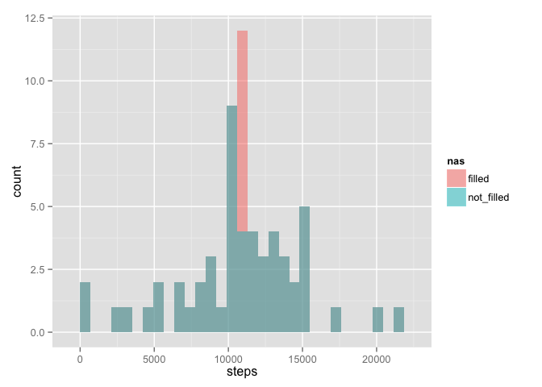

# Reproducible Research: Peer Assessment 1
Ofelia V.  
14 Dec 2014  
===============================================================================  
First set the general options for the `knitr` package.


```r
library(knitr)
opts_chunk$set(echo = TRUE)
opts_chunk$set(results = "markup")
```
## Introduction

This assignment makes use of data from a personal activity monitoring device. This device collects data at 5 minute intervals through out the day. The data consists of two months of data from an anonymous individual collected during the months of October and November, 2012 and include the number of steps taken in 5 minute intervals each day.

## Loading and preprocessing the data

Before loading the data, a few comments: I "previewed" the data in a text editor to 
see:

- If it had a header. It does.
- I verified that the file is comma-separated.
- I saw that the date formatting is the default one. Then I can directly read the date as a variable with formatting "date".
- I use he information given about the format of the `NA` values.

Then, I just loaded the data (I didn't think the data needed any pre-processing) and I took a look at it using `str` and `summary`.


```r
data <- read.csv("./activity.csv", header = TRUE, na.strings = "NA",
                     colClasses = c("numeric", "Date", "numeric"))
print(str(data))
```

```
## 'data.frame':	17568 obs. of  3 variables:
##  $ steps   : num  NA NA NA NA NA NA NA NA NA NA ...
##  $ date    : Date, format: "2012-10-01" "2012-10-01" ...
##  $ interval: num  0 5 10 15 20 25 30 35 40 45 ...
## NULL
```

```r
print(summary(data))
```

```
##      steps             date               interval     
##  Min.   :  0.00   Min.   :2012-10-01   Min.   :   0.0  
##  1st Qu.:  0.00   1st Qu.:2012-10-16   1st Qu.: 588.8  
##  Median :  0.00   Median :2012-10-31   Median :1177.5  
##  Mean   : 37.38   Mean   :2012-10-31   Mean   :1177.5  
##  3rd Qu.: 12.00   3rd Qu.:2012-11-15   3rd Qu.:1766.2  
##  Max.   :806.00   Max.   :2012-11-30   Max.   :2355.0  
##  NA's   :2304
```


## What is mean total number of steps taken per day?

For this part of the assignment, we are going to ignore the missing values. To calculate the total (their `sum`), the mean and median number of steps per day, I am going to use the function "summarize\_each" from the package "dplyr". It allows for multiple functions to be applied to the same data.frame/table. I have to "group" the data per day, and this I realize by using the function "group\_by". I do this and take a look at the result.


```r
library(dplyr)
grouped <- group_by(data, date)
spd  <-  summarise_each(grouped, funs(sum, mean, median), steps)

print(str(spd))
```

```
## Classes 'tbl_df', 'tbl' and 'data.frame':	61 obs. of  4 variables:
##  $ date  : Date, format: "2012-10-01" "2012-10-02" ...
##  $ sum   : num  NA 126 11352 12116 13294 ...
##  $ mean  : num  NA 0.438 39.417 42.069 46.16 ...
##  $ median: num  NA 0 0 0 0 0 0 NA 0 0 ...
##  - attr(*, "drop")= logi TRUE
## NULL
```

### Histogram of the total number of steps taken each day

I will use the base plotting system for this figure.


```r
hist(spd$sum, main = "Histogram of the total number of steps taken each day", 
     xlab = "Total number of steps per day")
```


It is clear this person gets his 10000 steps a day, for most of the days.

### Report of the mean and median number of steps taken per day

To report the mean and median of the steps per day, I will just print a table with the results of the functions `mean` and `median`. To print this table, I will use the "xtable" package.


```r
library(xtable)
# xtable messes up the dates, so I have to input the data in this awkward way
spd.table <- xtable(data.frame(Date = as.character(spd$date), sum = spd$sum, 
                               mean = spd$mean, median = spd$median), 
                    display = c("d","s", "d", "f", "d"))
print(spd.table, type = "html")
```

<!-- html table generated in R 3.1.1 by xtable 1.7-4 package -->
<!-- Sun Dec 14 17:33:07 2014 -->
<table border=1>
<tr> <th>  </th> <th> Date </th> <th> sum </th> <th> mean </th> <th> median </th>  </tr>
  <tr> <td align="right"> 1 </td> <td> 2012-10-01 </td> <td align="right">  </td> <td align="right">  </td> <td align="right">  </td> </tr>
  <tr> <td align="right"> 2 </td> <td> 2012-10-02 </td> <td align="right"> 126 </td> <td align="right"> 0.44 </td> <td align="right">   0 </td> </tr>
  <tr> <td align="right"> 3 </td> <td> 2012-10-03 </td> <td align="right"> 11352 </td> <td align="right"> 39.42 </td> <td align="right">   0 </td> </tr>
  <tr> <td align="right"> 4 </td> <td> 2012-10-04 </td> <td align="right"> 12116 </td> <td align="right"> 42.07 </td> <td align="right">   0 </td> </tr>
  <tr> <td align="right"> 5 </td> <td> 2012-10-05 </td> <td align="right"> 13294 </td> <td align="right"> 46.16 </td> <td align="right">   0 </td> </tr>
  <tr> <td align="right"> 6 </td> <td> 2012-10-06 </td> <td align="right"> 15420 </td> <td align="right"> 53.54 </td> <td align="right">   0 </td> </tr>
  <tr> <td align="right"> 7 </td> <td> 2012-10-07 </td> <td align="right"> 11015 </td> <td align="right"> 38.25 </td> <td align="right">   0 </td> </tr>
  <tr> <td align="right"> 8 </td> <td> 2012-10-08 </td> <td align="right">  </td> <td align="right">  </td> <td align="right">  </td> </tr>
  <tr> <td align="right"> 9 </td> <td> 2012-10-09 </td> <td align="right"> 12811 </td> <td align="right"> 44.48 </td> <td align="right">   0 </td> </tr>
  <tr> <td align="right"> 10 </td> <td> 2012-10-10 </td> <td align="right"> 9900 </td> <td align="right"> 34.38 </td> <td align="right">   0 </td> </tr>
  <tr> <td align="right"> 11 </td> <td> 2012-10-11 </td> <td align="right"> 10304 </td> <td align="right"> 35.78 </td> <td align="right">   0 </td> </tr>
  <tr> <td align="right"> 12 </td> <td> 2012-10-12 </td> <td align="right"> 17382 </td> <td align="right"> 60.35 </td> <td align="right">   0 </td> </tr>
  <tr> <td align="right"> 13 </td> <td> 2012-10-13 </td> <td align="right"> 12426 </td> <td align="right"> 43.15 </td> <td align="right">   0 </td> </tr>
  <tr> <td align="right"> 14 </td> <td> 2012-10-14 </td> <td align="right"> 15098 </td> <td align="right"> 52.42 </td> <td align="right">   0 </td> </tr>
  <tr> <td align="right"> 15 </td> <td> 2012-10-15 </td> <td align="right"> 10139 </td> <td align="right"> 35.20 </td> <td align="right">   0 </td> </tr>
  <tr> <td align="right"> 16 </td> <td> 2012-10-16 </td> <td align="right"> 15084 </td> <td align="right"> 52.38 </td> <td align="right">   0 </td> </tr>
  <tr> <td align="right"> 17 </td> <td> 2012-10-17 </td> <td align="right"> 13452 </td> <td align="right"> 46.71 </td> <td align="right">   0 </td> </tr>
  <tr> <td align="right"> 18 </td> <td> 2012-10-18 </td> <td align="right"> 10056 </td> <td align="right"> 34.92 </td> <td align="right">   0 </td> </tr>
  <tr> <td align="right"> 19 </td> <td> 2012-10-19 </td> <td align="right"> 11829 </td> <td align="right"> 41.07 </td> <td align="right">   0 </td> </tr>
  <tr> <td align="right"> 20 </td> <td> 2012-10-20 </td> <td align="right"> 10395 </td> <td align="right"> 36.09 </td> <td align="right">   0 </td> </tr>
  <tr> <td align="right"> 21 </td> <td> 2012-10-21 </td> <td align="right"> 8821 </td> <td align="right"> 30.63 </td> <td align="right">   0 </td> </tr>
  <tr> <td align="right"> 22 </td> <td> 2012-10-22 </td> <td align="right"> 13460 </td> <td align="right"> 46.74 </td> <td align="right">   0 </td> </tr>
  <tr> <td align="right"> 23 </td> <td> 2012-10-23 </td> <td align="right"> 8918 </td> <td align="right"> 30.97 </td> <td align="right">   0 </td> </tr>
  <tr> <td align="right"> 24 </td> <td> 2012-10-24 </td> <td align="right"> 8355 </td> <td align="right"> 29.01 </td> <td align="right">   0 </td> </tr>
  <tr> <td align="right"> 25 </td> <td> 2012-10-25 </td> <td align="right"> 2492 </td> <td align="right"> 8.65 </td> <td align="right">   0 </td> </tr>
  <tr> <td align="right"> 26 </td> <td> 2012-10-26 </td> <td align="right"> 6778 </td> <td align="right"> 23.53 </td> <td align="right">   0 </td> </tr>
  <tr> <td align="right"> 27 </td> <td> 2012-10-27 </td> <td align="right"> 10119 </td> <td align="right"> 35.14 </td> <td align="right">   0 </td> </tr>
  <tr> <td align="right"> 28 </td> <td> 2012-10-28 </td> <td align="right"> 11458 </td> <td align="right"> 39.78 </td> <td align="right">   0 </td> </tr>
  <tr> <td align="right"> 29 </td> <td> 2012-10-29 </td> <td align="right"> 5018 </td> <td align="right"> 17.42 </td> <td align="right">   0 </td> </tr>
  <tr> <td align="right"> 30 </td> <td> 2012-10-30 </td> <td align="right"> 9819 </td> <td align="right"> 34.09 </td> <td align="right">   0 </td> </tr>
  <tr> <td align="right"> 31 </td> <td> 2012-10-31 </td> <td align="right"> 15414 </td> <td align="right"> 53.52 </td> <td align="right">   0 </td> </tr>
  <tr> <td align="right"> 32 </td> <td> 2012-11-01 </td> <td align="right">  </td> <td align="right">  </td> <td align="right">  </td> </tr>
  <tr> <td align="right"> 33 </td> <td> 2012-11-02 </td> <td align="right"> 10600 </td> <td align="right"> 36.81 </td> <td align="right">   0 </td> </tr>
  <tr> <td align="right"> 34 </td> <td> 2012-11-03 </td> <td align="right"> 10571 </td> <td align="right"> 36.70 </td> <td align="right">   0 </td> </tr>
  <tr> <td align="right"> 35 </td> <td> 2012-11-04 </td> <td align="right">  </td> <td align="right">  </td> <td align="right">  </td> </tr>
  <tr> <td align="right"> 36 </td> <td> 2012-11-05 </td> <td align="right"> 10439 </td> <td align="right"> 36.25 </td> <td align="right">   0 </td> </tr>
  <tr> <td align="right"> 37 </td> <td> 2012-11-06 </td> <td align="right"> 8334 </td> <td align="right"> 28.94 </td> <td align="right">   0 </td> </tr>
  <tr> <td align="right"> 38 </td> <td> 2012-11-07 </td> <td align="right"> 12883 </td> <td align="right"> 44.73 </td> <td align="right">   0 </td> </tr>
  <tr> <td align="right"> 39 </td> <td> 2012-11-08 </td> <td align="right"> 3219 </td> <td align="right"> 11.18 </td> <td align="right">   0 </td> </tr>
  <tr> <td align="right"> 40 </td> <td> 2012-11-09 </td> <td align="right">  </td> <td align="right">  </td> <td align="right">  </td> </tr>
  <tr> <td align="right"> 41 </td> <td> 2012-11-10 </td> <td align="right">  </td> <td align="right">  </td> <td align="right">  </td> </tr>
  <tr> <td align="right"> 42 </td> <td> 2012-11-11 </td> <td align="right"> 12608 </td> <td align="right"> 43.78 </td> <td align="right">   0 </td> </tr>
  <tr> <td align="right"> 43 </td> <td> 2012-11-12 </td> <td align="right"> 10765 </td> <td align="right"> 37.38 </td> <td align="right">   0 </td> </tr>
  <tr> <td align="right"> 44 </td> <td> 2012-11-13 </td> <td align="right"> 7336 </td> <td align="right"> 25.47 </td> <td align="right">   0 </td> </tr>
  <tr> <td align="right"> 45 </td> <td> 2012-11-14 </td> <td align="right">  </td> <td align="right">  </td> <td align="right">  </td> </tr>
  <tr> <td align="right"> 46 </td> <td> 2012-11-15 </td> <td align="right">  41 </td> <td align="right"> 0.14 </td> <td align="right">   0 </td> </tr>
  <tr> <td align="right"> 47 </td> <td> 2012-11-16 </td> <td align="right"> 5441 </td> <td align="right"> 18.89 </td> <td align="right">   0 </td> </tr>
  <tr> <td align="right"> 48 </td> <td> 2012-11-17 </td> <td align="right"> 14339 </td> <td align="right"> 49.79 </td> <td align="right">   0 </td> </tr>
  <tr> <td align="right"> 49 </td> <td> 2012-11-18 </td> <td align="right"> 15110 </td> <td align="right"> 52.47 </td> <td align="right">   0 </td> </tr>
  <tr> <td align="right"> 50 </td> <td> 2012-11-19 </td> <td align="right"> 8841 </td> <td align="right"> 30.70 </td> <td align="right">   0 </td> </tr>
  <tr> <td align="right"> 51 </td> <td> 2012-11-20 </td> <td align="right"> 4472 </td> <td align="right"> 15.53 </td> <td align="right">   0 </td> </tr>
  <tr> <td align="right"> 52 </td> <td> 2012-11-21 </td> <td align="right"> 12787 </td> <td align="right"> 44.40 </td> <td align="right">   0 </td> </tr>
  <tr> <td align="right"> 53 </td> <td> 2012-11-22 </td> <td align="right"> 20427 </td> <td align="right"> 70.93 </td> <td align="right">   0 </td> </tr>
  <tr> <td align="right"> 54 </td> <td> 2012-11-23 </td> <td align="right"> 21194 </td> <td align="right"> 73.59 </td> <td align="right">   0 </td> </tr>
  <tr> <td align="right"> 55 </td> <td> 2012-11-24 </td> <td align="right"> 14478 </td> <td align="right"> 50.27 </td> <td align="right">   0 </td> </tr>
  <tr> <td align="right"> 56 </td> <td> 2012-11-25 </td> <td align="right"> 11834 </td> <td align="right"> 41.09 </td> <td align="right">   0 </td> </tr>
  <tr> <td align="right"> 57 </td> <td> 2012-11-26 </td> <td align="right"> 11162 </td> <td align="right"> 38.76 </td> <td align="right">   0 </td> </tr>
  <tr> <td align="right"> 58 </td> <td> 2012-11-27 </td> <td align="right"> 13646 </td> <td align="right"> 47.38 </td> <td align="right">   0 </td> </tr>
  <tr> <td align="right"> 59 </td> <td> 2012-11-28 </td> <td align="right"> 10183 </td> <td align="right"> 35.36 </td> <td align="right">   0 </td> </tr>
  <tr> <td align="right"> 60 </td> <td> 2012-11-29 </td> <td align="right"> 7047 </td> <td align="right"> 24.47 </td> <td align="right">   0 </td> </tr>
  <tr> <td align="right"> 61 </td> <td> 2012-11-30 </td> <td align="right">  </td> <td align="right">  </td> <td align="right">  </td> </tr>
   </table>

Also, a plot of the data per day is shown below, together with the mean (in black) and the median (in red) (I could not figure out a nice way to put labels on time). 


```r
library(lattice)
sed <- xyplot(steps ~ interval | date, data = grouped, type = "l",
             layout = c(10,7), panel = function(x,y,...){
                   panel.xyplot(x, y, ...)
                   panel.abline(h = median(y), lty = 2, col = "red", lwd = 2)
                   panel.abline(h = mean(y), lty = 2, col = "black", lwd = 2)
             })
print(sed)
```


## What is the average daily activity pattern?

To calculate the average daily activity pattern, instead of grouping the data by date, I group it by the "interval" and take the mean. As there are `NA` values present, I must take care they are ignored. As usual, I take a peek of the result using "str".


```r
spi <- summarise_each(group_by(data, interval), funs(mean(.,na.rm = T)), steps)
print(str(spi))
```

```
## Classes 'tbl_df', 'tbl' and 'data.frame':	288 obs. of  2 variables:
##  $ interval: num  0 5 10 15 20 25 30 35 40 45 ...
##  $ steps   : num  1.717 0.3396 0.1321 0.1509 0.0755 ...
##  - attr(*, "drop")= logi TRUE
## NULL
```

I would like to plot the "interval" variable as a time variable, so I create a little fake variable called "timeday", and use this variable to plot the average number of steps, by the time of the day.


```r
timeday <- strptime(formatC(spi$interval, width = 4, flag = "0"), 
                    format = "%H%M")
plot(timeday,spi$steps, type = "l", main = "Average number of steps taken (averaged across all days)",
     xlab = "interval/time(hh:mm)", ylab = "Average number of steps")
```


```r
intmaxsteps <- spi$interval[which.max(spi$steps)]
```

**The maximum number of steps is reached at the interval 835 (8:35 in the morning)**. This person probably goes for a morning run...

## Imputing missing values

I want to calculate the number of rows that have missing numbers. For this I use the function `complete.cases` that gives a logical `TRUE` when the row is complete and has no `NA` values. I take the opposite of it and add all the values up, therefore all the TRUE values (now the incomplete rows) are added up.


```r
missing <- sum(!complete.cases(data))
```

There are a number of days that have missing values. The total number of rows that have missing values amounts to 2304. I will fill those rows up using the *rounded* total data average in the corresponding interval.  
My method for filling is not very sophisticated and if I had more time, I would refine it.  
As the `NA` values are concentrated in the "steps" variable, I use this knowledge to calculate a vector that gives the interval where the steps variable is missing.


```r
nas <- is.na(data$steps)
intnas <- data$interval[nas]
n <- length(unique(intnas))
print(n)
```

```
## [1] 288
```

As the number of unique missing interval values is not very large (288), I'll set a loop to change the missing values by interval number.


```r
# Create a "stepsFilled" variable as a copy of the steps variable
data$stepsFilled <- data$steps
for (i in 1:n){
      # select the interval value
      intna <- unique(intnas)[i]
      # select the missing interval values that correspond to the selected interval value above
      cond1 <- intnas == intna
      # select the value of the average of steps that corresponds to the selected interval value above
      cond2 <- spi$interval == intna
      # replace the missing values with the rounded average value of steps
      data$stepsFilled[nas][cond1] <- round(spi$steps[cond2])
}
```

The result can be seen below, comparing the column "steps" with "stepsFilled". (When there are missing values, it replaces them with the average step values. When there are values present, it does nothing)


```r
print(data[283:294,])
```

```
##     steps       date interval stepsFilled
## 283    NA 2012-10-01     2330           3
## 284    NA 2012-10-01     2335           5
## 285    NA 2012-10-01     2340           3
## 286    NA 2012-10-01     2345           1
## 287    NA 2012-10-01     2350           0
## 288    NA 2012-10-01     2355           1
## 289     0 2012-10-02        0           0
## 290     0 2012-10-02        5           0
## 291     0 2012-10-02       10           0
## 292     0 2012-10-02       15           0
## 293     0 2012-10-02       20           0
## 294     0 2012-10-02       25           0
```

### Histogram of the total number of steps taken each day after missing values were imputed

I need to do exactly the same I did before: group the data by date and then take the sum, average and median, but now with the filled data.


```r
grouped2 <- group_by(data, date)
spdf  <-  summarise_each(grouped2, funs(sum, mean, median), stepsFilled)

print(str(spdf))
```

```
## Classes 'tbl_df', 'tbl' and 'data.frame':	61 obs. of  4 variables:
##  $ date  : Date, format: "2012-10-01" "2012-10-02" ...
##  $ sum   : num  10762 126 11352 12116 13294 ...
##  $ mean  : num  37.368 0.438 39.417 42.069 46.16 ...
##  $ median: num  34.5 0 0 0 0 0 0 34.5 0 0 ...
##  - attr(*, "drop")= logi TRUE
## NULL
```

Same as before, the histogram of the total number of steps:


```r
hist(spdf$sum, main = "Histogram of the total number of steps taken each day after missing values were imputed", 
     xlab = "Total number of steps per day")
```


Truthfully, I cannot see the difference before and after imputing the missing values. I would like to compare the two histograms and I like the aesthetics of the package "ggplot2". I found this solution on how to use the histograms [here](http://stackoverflow.com/questions/3541713/how-to-plot-two-histograms-together-in-r).


```r
library(ggplot2)
notfilled <- data.frame(steps = spd$sum)
filled <- data.frame(steps = spdf$sum)

notfilled$nas <- "not_filled"
filled$nas  <- "filled"

fakedata <- rbind(filled, notfilled)

h <- ggplot(fakedata, aes(steps, fill = nas)) + geom_histogram(alpha = 0.5, 
                                                         position = 'identity')
plot(h)
```



### Report the mean and median number of steps taken per day

I do exactly the same as before, only with the data that has been filled.


```r
spd.table <- xtable(data.frame(Date = as.character(spdf$date), sum = spdf$sum, 
                               mean = spdf$mean, median = spdf$median), 
                    display = c("d","s", "d", "f", "d"))
print(spd.table, type = "html")
```

<!-- html table generated in R 3.1.1 by xtable 1.7-4 package -->
<!-- Sun Dec 14 17:33:10 2014 -->
<table border=1>
<tr> <th>  </th> <th> Date </th> <th> sum </th> <th> mean </th> <th> median </th>  </tr>
  <tr> <td align="right"> 1 </td> <td> 2012-10-01 </td> <td align="right"> 10762 </td> <td align="right"> 37.37 </td> <td align="right">  34 </td> </tr>
  <tr> <td align="right"> 2 </td> <td> 2012-10-02 </td> <td align="right"> 126 </td> <td align="right"> 0.44 </td> <td align="right">   0 </td> </tr>
  <tr> <td align="right"> 3 </td> <td> 2012-10-03 </td> <td align="right"> 11352 </td> <td align="right"> 39.42 </td> <td align="right">   0 </td> </tr>
  <tr> <td align="right"> 4 </td> <td> 2012-10-04 </td> <td align="right"> 12116 </td> <td align="right"> 42.07 </td> <td align="right">   0 </td> </tr>
  <tr> <td align="right"> 5 </td> <td> 2012-10-05 </td> <td align="right"> 13294 </td> <td align="right"> 46.16 </td> <td align="right">   0 </td> </tr>
  <tr> <td align="right"> 6 </td> <td> 2012-10-06 </td> <td align="right"> 15420 </td> <td align="right"> 53.54 </td> <td align="right">   0 </td> </tr>
  <tr> <td align="right"> 7 </td> <td> 2012-10-07 </td> <td align="right"> 11015 </td> <td align="right"> 38.25 </td> <td align="right">   0 </td> </tr>
  <tr> <td align="right"> 8 </td> <td> 2012-10-08 </td> <td align="right"> 10762 </td> <td align="right"> 37.37 </td> <td align="right">  34 </td> </tr>
  <tr> <td align="right"> 9 </td> <td> 2012-10-09 </td> <td align="right"> 12811 </td> <td align="right"> 44.48 </td> <td align="right">   0 </td> </tr>
  <tr> <td align="right"> 10 </td> <td> 2012-10-10 </td> <td align="right"> 9900 </td> <td align="right"> 34.38 </td> <td align="right">   0 </td> </tr>
  <tr> <td align="right"> 11 </td> <td> 2012-10-11 </td> <td align="right"> 10304 </td> <td align="right"> 35.78 </td> <td align="right">   0 </td> </tr>
  <tr> <td align="right"> 12 </td> <td> 2012-10-12 </td> <td align="right"> 17382 </td> <td align="right"> 60.35 </td> <td align="right">   0 </td> </tr>
  <tr> <td align="right"> 13 </td> <td> 2012-10-13 </td> <td align="right"> 12426 </td> <td align="right"> 43.15 </td> <td align="right">   0 </td> </tr>
  <tr> <td align="right"> 14 </td> <td> 2012-10-14 </td> <td align="right"> 15098 </td> <td align="right"> 52.42 </td> <td align="right">   0 </td> </tr>
  <tr> <td align="right"> 15 </td> <td> 2012-10-15 </td> <td align="right"> 10139 </td> <td align="right"> 35.20 </td> <td align="right">   0 </td> </tr>
  <tr> <td align="right"> 16 </td> <td> 2012-10-16 </td> <td align="right"> 15084 </td> <td align="right"> 52.38 </td> <td align="right">   0 </td> </tr>
  <tr> <td align="right"> 17 </td> <td> 2012-10-17 </td> <td align="right"> 13452 </td> <td align="right"> 46.71 </td> <td align="right">   0 </td> </tr>
  <tr> <td align="right"> 18 </td> <td> 2012-10-18 </td> <td align="right"> 10056 </td> <td align="right"> 34.92 </td> <td align="right">   0 </td> </tr>
  <tr> <td align="right"> 19 </td> <td> 2012-10-19 </td> <td align="right"> 11829 </td> <td align="right"> 41.07 </td> <td align="right">   0 </td> </tr>
  <tr> <td align="right"> 20 </td> <td> 2012-10-20 </td> <td align="right"> 10395 </td> <td align="right"> 36.09 </td> <td align="right">   0 </td> </tr>
  <tr> <td align="right"> 21 </td> <td> 2012-10-21 </td> <td align="right"> 8821 </td> <td align="right"> 30.63 </td> <td align="right">   0 </td> </tr>
  <tr> <td align="right"> 22 </td> <td> 2012-10-22 </td> <td align="right"> 13460 </td> <td align="right"> 46.74 </td> <td align="right">   0 </td> </tr>
  <tr> <td align="right"> 23 </td> <td> 2012-10-23 </td> <td align="right"> 8918 </td> <td align="right"> 30.97 </td> <td align="right">   0 </td> </tr>
  <tr> <td align="right"> 24 </td> <td> 2012-10-24 </td> <td align="right"> 8355 </td> <td align="right"> 29.01 </td> <td align="right">   0 </td> </tr>
  <tr> <td align="right"> 25 </td> <td> 2012-10-25 </td> <td align="right"> 2492 </td> <td align="right"> 8.65 </td> <td align="right">   0 </td> </tr>
  <tr> <td align="right"> 26 </td> <td> 2012-10-26 </td> <td align="right"> 6778 </td> <td align="right"> 23.53 </td> <td align="right">   0 </td> </tr>
  <tr> <td align="right"> 27 </td> <td> 2012-10-27 </td> <td align="right"> 10119 </td> <td align="right"> 35.14 </td> <td align="right">   0 </td> </tr>
  <tr> <td align="right"> 28 </td> <td> 2012-10-28 </td> <td align="right"> 11458 </td> <td align="right"> 39.78 </td> <td align="right">   0 </td> </tr>
  <tr> <td align="right"> 29 </td> <td> 2012-10-29 </td> <td align="right"> 5018 </td> <td align="right"> 17.42 </td> <td align="right">   0 </td> </tr>
  <tr> <td align="right"> 30 </td> <td> 2012-10-30 </td> <td align="right"> 9819 </td> <td align="right"> 34.09 </td> <td align="right">   0 </td> </tr>
  <tr> <td align="right"> 31 </td> <td> 2012-10-31 </td> <td align="right"> 15414 </td> <td align="right"> 53.52 </td> <td align="right">   0 </td> </tr>
  <tr> <td align="right"> 32 </td> <td> 2012-11-01 </td> <td align="right"> 10762 </td> <td align="right"> 37.37 </td> <td align="right">  34 </td> </tr>
  <tr> <td align="right"> 33 </td> <td> 2012-11-02 </td> <td align="right"> 10600 </td> <td align="right"> 36.81 </td> <td align="right">   0 </td> </tr>
  <tr> <td align="right"> 34 </td> <td> 2012-11-03 </td> <td align="right"> 10571 </td> <td align="right"> 36.70 </td> <td align="right">   0 </td> </tr>
  <tr> <td align="right"> 35 </td> <td> 2012-11-04 </td> <td align="right"> 10762 </td> <td align="right"> 37.37 </td> <td align="right">  34 </td> </tr>
  <tr> <td align="right"> 36 </td> <td> 2012-11-05 </td> <td align="right"> 10439 </td> <td align="right"> 36.25 </td> <td align="right">   0 </td> </tr>
  <tr> <td align="right"> 37 </td> <td> 2012-11-06 </td> <td align="right"> 8334 </td> <td align="right"> 28.94 </td> <td align="right">   0 </td> </tr>
  <tr> <td align="right"> 38 </td> <td> 2012-11-07 </td> <td align="right"> 12883 </td> <td align="right"> 44.73 </td> <td align="right">   0 </td> </tr>
  <tr> <td align="right"> 39 </td> <td> 2012-11-08 </td> <td align="right"> 3219 </td> <td align="right"> 11.18 </td> <td align="right">   0 </td> </tr>
  <tr> <td align="right"> 40 </td> <td> 2012-11-09 </td> <td align="right"> 10762 </td> <td align="right"> 37.37 </td> <td align="right">  34 </td> </tr>
  <tr> <td align="right"> 41 </td> <td> 2012-11-10 </td> <td align="right"> 10762 </td> <td align="right"> 37.37 </td> <td align="right">  34 </td> </tr>
  <tr> <td align="right"> 42 </td> <td> 2012-11-11 </td> <td align="right"> 12608 </td> <td align="right"> 43.78 </td> <td align="right">   0 </td> </tr>
  <tr> <td align="right"> 43 </td> <td> 2012-11-12 </td> <td align="right"> 10765 </td> <td align="right"> 37.38 </td> <td align="right">   0 </td> </tr>
  <tr> <td align="right"> 44 </td> <td> 2012-11-13 </td> <td align="right"> 7336 </td> <td align="right"> 25.47 </td> <td align="right">   0 </td> </tr>
  <tr> <td align="right"> 45 </td> <td> 2012-11-14 </td> <td align="right"> 10762 </td> <td align="right"> 37.37 </td> <td align="right">  34 </td> </tr>
  <tr> <td align="right"> 46 </td> <td> 2012-11-15 </td> <td align="right">  41 </td> <td align="right"> 0.14 </td> <td align="right">   0 </td> </tr>
  <tr> <td align="right"> 47 </td> <td> 2012-11-16 </td> <td align="right"> 5441 </td> <td align="right"> 18.89 </td> <td align="right">   0 </td> </tr>
  <tr> <td align="right"> 48 </td> <td> 2012-11-17 </td> <td align="right"> 14339 </td> <td align="right"> 49.79 </td> <td align="right">   0 </td> </tr>
  <tr> <td align="right"> 49 </td> <td> 2012-11-18 </td> <td align="right"> 15110 </td> <td align="right"> 52.47 </td> <td align="right">   0 </td> </tr>
  <tr> <td align="right"> 50 </td> <td> 2012-11-19 </td> <td align="right"> 8841 </td> <td align="right"> 30.70 </td> <td align="right">   0 </td> </tr>
  <tr> <td align="right"> 51 </td> <td> 2012-11-20 </td> <td align="right"> 4472 </td> <td align="right"> 15.53 </td> <td align="right">   0 </td> </tr>
  <tr> <td align="right"> 52 </td> <td> 2012-11-21 </td> <td align="right"> 12787 </td> <td align="right"> 44.40 </td> <td align="right">   0 </td> </tr>
  <tr> <td align="right"> 53 </td> <td> 2012-11-22 </td> <td align="right"> 20427 </td> <td align="right"> 70.93 </td> <td align="right">   0 </td> </tr>
  <tr> <td align="right"> 54 </td> <td> 2012-11-23 </td> <td align="right"> 21194 </td> <td align="right"> 73.59 </td> <td align="right">   0 </td> </tr>
  <tr> <td align="right"> 55 </td> <td> 2012-11-24 </td> <td align="right"> 14478 </td> <td align="right"> 50.27 </td> <td align="right">   0 </td> </tr>
  <tr> <td align="right"> 56 </td> <td> 2012-11-25 </td> <td align="right"> 11834 </td> <td align="right"> 41.09 </td> <td align="right">   0 </td> </tr>
  <tr> <td align="right"> 57 </td> <td> 2012-11-26 </td> <td align="right"> 11162 </td> <td align="right"> 38.76 </td> <td align="right">   0 </td> </tr>
  <tr> <td align="right"> 58 </td> <td> 2012-11-27 </td> <td align="right"> 13646 </td> <td align="right"> 47.38 </td> <td align="right">   0 </td> </tr>
  <tr> <td align="right"> 59 </td> <td> 2012-11-28 </td> <td align="right"> 10183 </td> <td align="right"> 35.36 </td> <td align="right">   0 </td> </tr>
  <tr> <td align="right"> 60 </td> <td> 2012-11-29 </td> <td align="right"> 7047 </td> <td align="right"> 24.47 </td> <td align="right">   0 </td> </tr>
  <tr> <td align="right"> 61 </td> <td> 2012-11-30 </td> <td align="right"> 10762 </td> <td align="right"> 37.37 </td> <td align="right">  34 </td> </tr>
   </table>

The most notorious result is how the median is affected. The filled data has a median different from zero. Also, a plot of the data per day is shown below, together with the mean (in black) and the median (in red).


```r
library(lattice) # I need to recall lattice all the time because this plot has been cached.
sed2 <- xyplot(stepsFilled ~ interval | date, data = grouped2, type = "l",
             layout = c(10,7), panel = function(x,y,...){
                   panel.xyplot(x, y, ...)
                   panel.abline(h = median(y), lty = 2, col = "red", lwd = 2)
                   panel.abline(h = mean(y), lty = 2, col = "black", lwd = 2)
             })
print(sed2)
```


## Are there differences in activity patterns between weekdays and weekends?

To find this out, I will use the function `weekdays()`. I create a new variable called "weekday" that indicates if the day is part of the weekend (Saturday or Sunday) or the weekdays (the rest of the days).


```r
weekday <- weekdays(data$date)
cond <- weekday == "Saturday" | weekday == "Sunday"
dummy <- rep("weekday", length.out = length(data$date))
dummy[cond] <- "weekend"
data$weekday <- factor(dummy)

# divide the data by the factor weekday

spw <- summarise_each(group_by(data, weekday, interval), funs(mean), 
                      stepsFilled)
```


### Panel plot comparing the average number of steps taken per 5-minute interval across weekdays and weekends

The lattice package is ideal to make this plot.


```r
library(lattice)
print(xyplot(stepsFilled ~ interval | weekday, data = spw, type = "l",
             layout = c(1,2), xlab = "Interval", ylab = "Number of steps"))
```


There are clear differences in the activity during the week (this person wakes up early!) and the weekend (the person wakes up a little later). During the week there is a peak of activity in the morning (around 8:35) and the rest of the day is a bit more sedentary. The weekend has not as large peaks of activity but the overall activity seems to increase.

